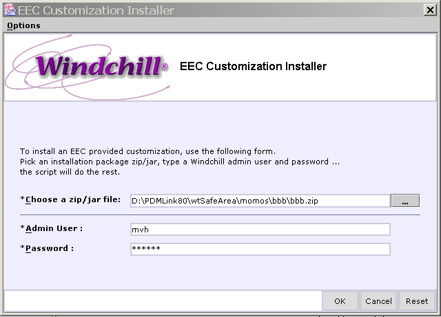
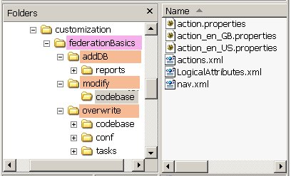
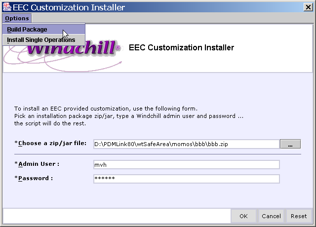
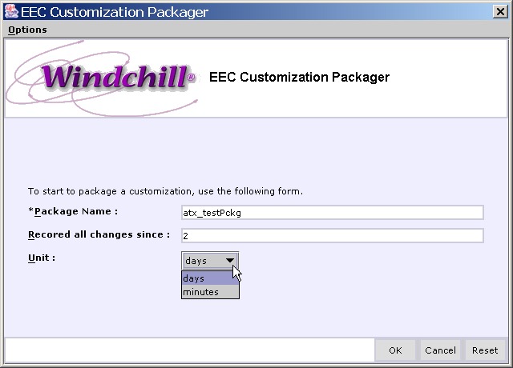

# Windchill Customization Installer
aka *EEC Generic Customization Installer*

## TOC
- [Summary](#summary)
- [Usage](#usage)
	- [GUI Installer](#gui-installer)
	- [Command Line Installer](#command-line-installer)
- [How to Build Installation Packages](#how-to-build-installation-packages)
	- [Folder Structure Rules](#folder-structure-rules)
	- [XML File Addition Format](#xml-file-addition-format)
	- [Supporting Tool for building a package from <wt.home>](#supporting-tool-for-building-a-package-from-wthome)
- [Uncovered Functionality / Envisioned Enhancements](#uncovered-functionality--envisioned-enhancements)
- [Installation](#installation)


## **Summary**

For a person that wants to install a customization, this tool allows the installation of complex Windchill customizations with a single batch command.

For customization providers it allows to package their customizations without any installation documentation and without any scripting required. 
The files for a customization just have to be placed in a specific folder structure and for very few files specific formatting has to be fulfilled.

The Generic Customization Installer is an Ant-script based installer of Windchill customizations that allows automating the different installation procedures 
by following a simple packaging guideline. The following installation procedures are supported with a single batch command:

- Additions to xconf files with propagation
- Additions to LogicalAttributes.xml
- Additions to actions.xml, nav.xml, actionmodels.xml and NavigationAndActions.xml with respect to the location of the addition
- Additions to 'raw' properties files like action.properties and its localizations
- Loading of Windchill Data like Reports, Workflow/Lifecycle/…-Templates using LoadFromFile or IXB (also supports direct loading of exported zip/jars)
- Loading of TaskDelegates
- Loading of Ldif files
- Extraction of class and other resource files
- Execution of included ant tasks for generic purpose, e.g.: preprocessing of load data like replacement of tokens in loadFiles.
- Backup of all relevant files to wtSafeArea

The installer creates a backup zip file of (nearly) all changed or overwritten files. This zip file allows an easy 'rollback'
 of the installation to the status before the installation. It also contains a log file of the installation procedure.


## **Usage**

### **GUI Installer**

To start the Installer GUI, type in a Windchill shell:

```
cd customization
ant
```

The following UI will come up:



Follow the instructions.

You can also use the command line version of the installer:

### **Command Line Installer**

**On Windows:**

1. save the customization package zip file to your machine, e.g. c:\temp\ExtendedFolderView.zip
2. in windchill shell:

 ```ant -f customization/wtinstaller.xml install -Dfile="<path to customization package zip file>" -Ddbuser=<adminUser> -Dpasswd=<admin_passwd>```

 e.g.:

 ```ant -f customization/wtinstaller.xml install -Dfile="c:\temp\ExtendedFolderView.zip" -Ddbuser=wcadmin -Dpasswd=wcadmin```


Windchill (and Tomcat) will restart automatically. If you want to suppress the restart, e.g. because the files in the install kit don't require it 
or you want to do multiple installs in a row, you can do so by adding the command line argument `–DsuppressRestart=1` or `–Dsr=1`. 
This works for both, the command line version as well as the UI version of the installer.

**Undo Installation Functionality**

For all files that are modified or overwritten a backup of the original file is done in one zip file per installation run. 
This zip file is named: *<tstamp>_<pckgName>_rollback.zip* and is put to *<wt.home>/customization/rollback* and can be used to rollback the installation by simply extracting it to <wt.home>. 
It is important to notice that changes in the Oracle or LDAP database will not be rolled back so it might be necessary to do that manually.

Also a log file is created for every install run and is added to the rollback.zip that can be used to identify the issue if an installation was not successful.

e.g.: for the above mentioned installation the following rollback zip file is created:

*<wt.home>/customization/rollback/20050726011548_federationBasics_rollback.zip*

You should be aware that undo operations need to be reversed successively. If you installed customization A and then customization B and want to remove customization A, 
you'll have to extract xxx\_B\_rollback.zip, then xxx\_A\_rollback.zip and then reinstall customization B. This is not always necessary but the safest way to do it.

## How to Build Installation Packages

### **Folder Structure Rules**

A package is a zip file. In general it contains the files to install in a folder substructure corresponding to their original location relative to <wt.home>. 
The first level of the folder structure inside the package has a special meaning:

There are **multiple first level root folders** for different types of changes:

- **overwrite:** for resource files (like .class, .java, .rbinfo, .ser, .xsl, dca xml config files) that just have to be extracted to <wt.home>. 
  These files will be copied over existing files only if their modification date (in the zip) is newer than the existing file in the target Windchill installation. 
  This is a basic version control mechanism that should prevent that older versions of classes/resources that are included in multiple install kits 
  overwrite newer classes/resources with more capabilities or bug fixes. You can work around this behavior and force a replacement by the files 
  from your install kit by adding the command line option: *-DforceOverwrite=1*. If a file is overwritten, it is backed up in the rollback zip and in the wtSafeArea.

- **modify:** for config files that are **altered** by additions during the install process, namely:
	- .xconf files,
	- .property files that are not controlled by xconf
	- .xml files that get additions at specific locations like actions.xml and NavigationAndActions.xml
	- .rbInfo files that alter standard rbInfo files e.g. to add an entry to the LCState enumerated type-
	- .html files (e.g. if you want to include a auto-generated and growing web page). These files just contain the additions to the 
	  corresponding original files ( = delta of before and after installation).

  The modification files must be at the same path relative to *<pckgRootDir>/modify* then the files to modify relative to <wt.home> e.g.: 
  if you want to add entries to *<wt.home>/codebase/wt/templateutil/NavigationAndActions.xml* you have to put these additions in 
  *<zip.root>/modify/codebase/wt/templateutil/NavigationAndActions.xml*.

  The format of the files depends on their 'type':
  1. For files where the additions only get appended (.property, .rbInfo, .html) or inserted before the closing xml root node (.xconf, LogicalAttributes.xml) 
     the packaged file just lists the content to append.
  2. For xml file additions where the location in the modified file is relevant you have to follow a specific format ([see example below](#xmlAdditionExample) 
     as well as the file: <wt.home>/customization/ReadMe.txt)

- **addDB:** for files that effect changes in the oracle databases like loadFiles, or files that effect changes in the LDAP like .ptctar and .ldif files.

  For loadFiles: the folder of the files can be used to represent the container to load the data to: if the folder name contains an '=' sign it is assumed that
  it represents a container spec according the format used in the loadFromFile command, 
  
  e.g.: the file with the path in the install kit zip file: 
  `/addDB/wt.inf.container.OrgContainer=TST1/wt.inf.containerLibrary=Engine 3.4 tdi/TimelineChart_csv.xml`
  means that the `TimeLineChart_csv.xml` will be loaded to the library named `Engine 3.4 tdi` in the Organization named `TST1`.
  
  The loadFiles will be loaded in their alphabetic order based on the complete File Path.
  
  Required content (e.g. report qml files) will be copied to the Windchill loadFile subdirectories, so that the paths in the csvxml loadfiles can be resolved properly.
  
  Packages for Windchill versions < 10.0: Data that has been exported from Windchill using Import/Export functionality like Workflow Templates, TypeDefinitions or even 
  PartStructures with CAD Docs can be added to the package in the following way:
  
  Extract the export zip or jar file to the addDB directory or to a subdirectory representing the target container as described before. Because Import/Export files can be 
  loaded in the same way as csv derived loadfiles and vice versa this is all you'll have to do! Packages for >= 10.0: exported zip/jar files don't have to be extracted but 
  can be added as is to the addDB area. The mechanism to identify the container to load to works in the same way as before.

- **scripts:** to be as flexible as possible you can put ant tasks here that are executed just after the extraction of the package. These ant tasks inherit the properties and 
	refs from the build.xml ant script so you can use its properties like ${myPckgName} or ${wt.home}. The basedir of the included ant tasks is the <wt.home>/customization dir. 
	If multiple files are found in one of these directories, they will be executed in sorted by filename.
	The scripts directory might have subdirectories which control when an ant script is executed during the progress of the installation:

  - **pre:** is called just after the package is extracted to the <wt.home>/customization directory; might be used to replace data in the install files from 
	properties from the Windchill System
  - **preload:** is called after all files like resource/class files are copied to the codebase and before the load of data has started; can be used for 
	MakeJar scripts and restarting e.g. if a LC will be loaded with a custom state that has just been added before
  - **post:** is called at the end of the installation process; might be used for restarts

- **doc:** the content will be copied to <wt.home>/customization/doc.

- **components:** To support modularization of customizations you can add install kit zip files to this first-level folder. These sub-components will always be 
	installed before the embracing installation kit. If you need to control the sequence of the installation of multiple included components you can do so 
	by including a file /components/components.properties that can have the following entries:
  - **sequence:** value is a comma-separated list of component install kit filenames in the sequence they should be installed
  - **\<install kit filename>.requiresRestart:** value is 'true' (or any other). This controls if a restart is forced for a sub-component installation 
	(depends on the content of the sub-component; e.g. if an addition to the State EnumType is followed by loading an LCTemplate that uses this added LC State). 
	Only add a property if a restart is required as the installer just checks if there is a property and not its value!

### **XML File Addition Format**

The following is an example of file that specifies additions to xml files at a specific location:

````
<?xml version="1.0"?>
<modif>
	<fragment identifier="/tabmodels/model[@name='user navigation']/action[@name='list_mvh'][@type='work']" 
			  path="/tabmodels/model[@name='user navigation']/action[@name='list'][@type='work']" 
			  position="after">
				<![CDATA[
				<action name="list_mvh" type="work"/>
				]]>
	</fragment>
	<fragment identifier="/tabmodels/model [@name='list_mvh'][@type='work']" 
			  path="/tabmodels/model[@name ='list'][@type='work']" 
			  position="after">
				<![CDATA[
				<model type="work" name="list_mvh">
					<connect name="user navigation" selectedName="list_mvh" 
						selectedType="work"/>
				</model>
				]]>
	</fragment>        
</modif>
````

This is an addition to nav.xml:

<modif> is the root node

<fragment> specifies where to insert.

- It's *identifier* attribute identifies the position of the node for existence checking, the format is an XPath expression;
- It's *path* attribute selects the node relative to which your fragment is inserted, the format is an XPath expression;
- the *position* attribute specifies where to insert it, values are 'after','before' and 'under'
- the content (normally inside the <![CDATA[]]> section) specifies what to add

You can have as many <fragment> elements as you want!

Here are examples for all commonly used files:

**actions.xml:**

````
<modif>
	<fragment identifier="/listofactions/objecttype[@name='object']/action[@name='clipboardContent']"  
		      path="/listofactions/objecttype[@name='object']/action[@name='clearClipboard']" 
			  position="after">
				<![CDATA[
				<action name="clipboardContent" renderType="GENERAL" by="mvh">
					<command method="/wtcore/jsp/ext/utils/clipboardContent.jsp"  
							 windowType="popup"/>
					</action>
				]]> 
	</fragment>
</modif>
````

**actionmodels.xml:**

````
<modif>
	<fragment identifier="/actionmodels/model[@name='project context info bar actions']/action[name='clipboardContent']" 
			  path="/actionmodels/model[@name='project context info bar actions']/action[position()=last()]" 
			  position="after">
				<![CDATA[
				<action name="clipboardContent"     type="object" 	by="mvh"/>
				]]> 
	</fragment>
	<fragment identifier="/actionmodels/model[@name='project context info bar actions']/action[name='clipboardContent']" 
			  path="/actionmodels/model[@name='product context info bar actions']/action[position()=last()]" 
			  position="after">
				<![CDATA[
				<action name="clipboardContent"     type="object" 	by="mvh"/>
				]]> 
	</fragment>
</modif>
````

**nav.xml:** (see first example above)

**config/mvc/custom.xml:** in this one we have to deal with namespaces - default (see ':' in XPaths and xmlns declaration in <beans/> addition) and explicit (see xmlns:context declaration in <context:component-scan/> addition). This is due to the namespace declarations in the target custom.xml file.

````
<modif>
	<fragment identifier="/:beans/:bean[@class=’ext.part.mvc.PSBTreeConfigBuilder’]" 
			  path="/:beans" 
			  position="under">
				<![CDATA[
					<bean xmlns=http://www.springframework.org/schema/beans        class="ext.part.mvc.PSBTreeConfigBuilder" />
				]]>
	</fragment>
	<fragment identifier="/:beans/context:component-scan[@base-package='ext.part.mvc']" 
			  path="/:beans" 
			  position="under">
				<![CDATA[
				<context:component-scan xmlns:context="http://www.springframework.org/schema/context" base-package="ext.part.mvc" use-default-filters="true">
				<context:include-filter xmlns:context="http://www.springframework.org/schema/context" type="annotation" expression="com.ptc.cat.entity.server.MappedAttributeDataTypeOverride"/>
				</context:component-scan>
				]]>
	</fragment>
</modif>
````

**NavigationAndActions.xml:**

````
<modif>
	<fragment identifier="/NAVIGATION_TREES/NAVIGATION_TREE[Name='WTDOCUMENT_DOCUMENTSTRUCTURE_TABLE_ACTIONS']/Links/Link[Name='PASTETOUSES']" 
			  path="/NAVIGATION_TREES/NAVIGATION_TREE[Name='WTDOCUMENT_DOCUMENTSTRUCTURE_TABLE_ACTIONS']/Links/Link[Name='DocStrctRemoveChildren']" 
			  position="after">
				<![CDATA[
				<!--mvh start: add4DocMgmt paste-->
					<Link>
						<Name>PASTETOUSES</Name>
						<Action>PASTETOUSES</Action>
						<Tree_Action_Delegate/>
						<In_Minimum_List>true</In_Minimum_List>
						<Resource_Bundle>com.ptc.core.HTMLtemplateutil.server.processors.processorsResource</Resource_Bundle>
						<Resource_Key>4</Resource_Key>
						<Links/>
					</Link>
				<!--mvh end: add4DocMgmt paste-->
				]]>
	</fragment>
	<fragment identifier="/NAVIGATION_TREES/NAVIGATION_TREE[Name='DocumentReferencedBy_TableActions']" 
			  path="/NAVIGATION_TREES/NAVIGATION_TREE[Name='DocumentReferences_TableActions']" 
			  position="after">
				<![CDATA[
				 <!--mvh start: add4DocMgmt paste-->
				<NAVIGATION_TREE>
					<Name>DocumentReferencedBy_TableActions</Name>
					<Links>
						<Link>
							<Name>PASTETOREFERENCEDBY</Name>
							<Action>PASTETOREFERENCEDBY</Action>
							<Tree_Action_Delegate/>
							<In_Minimum_List>true</In_Minimum_List>
							<Resource_Bundle>com.ptc.core.HTMLtemplateutil.server.processors.processorsResource</Resource_Bundle>
							<Resource_Key>4</Resource_Key>
							<Links/>
						</Link>
					</Links>
				</NAVIGATION_TREE>
				]]>
	</fragment>	     
</modif>
````

### **Supporting Tool for building a package from <wt.home>**

To support the packaging process as much as possible the following command extracts the latest changes made to files in your Windchill installation 
and sorts them to the corresponding root directories. In a windchill shell type:

````
ant -f customization/build.xml buildPckg -DsinceDays=<numdays> -Dname=<pckgName>
````

This will create a subfolder with the name *<pckgName>* in <wt.home>/customization that contain the three root folders and all files 
of your Windchill installation that have been modified in the last *<numdays>.* For a more fine-grained access to changes the option 
*–DsinceMinutes* can also be used instead of *–DsinceDays*.

e.g.:
````
ant -f customization/build.xml buildPckg -DsinceDays=2 -Dname=federationBasics
````
creates the following directory structure under <wt.home>/customization:



Highlighted in magenta is the package root folder, highlighted in red are the three first level folders, 
in grey you can see the selected folder with examples of files to modify.

Be aware that the packaging scans your complete Windchill installation for file changes and thus don't wonder 
if it takes 5 - 10 min (on a Laptop) and if the Harddisk really moves.

You can also use the Installer GUI to build a package:



Use the menu to get to the 'Build Package' functionality.



Specify a package name. This name will be used for the subfolder in <wt.home>/customization where the collected modified files 
will be copied to. Depending on their type they will be moved intelligently to one of the subfolders (modify or overwrite).


# Uncovered Functionality / Envisioned Enhancements

- Auto generated overview page of installed Customizations


# Installation

To install the Generic Installer download the installer.zip from the [Releases link](../../releases) on the right and extract it to <wt.home>.


## 
**Conditions of Use** 
This document is provided unsupported. The contents of this document may not have been reviewed and have not been approved. 
They are therefore provided 'as-is'. Feedback on this document is welcome to assist other users in assessing its value.
